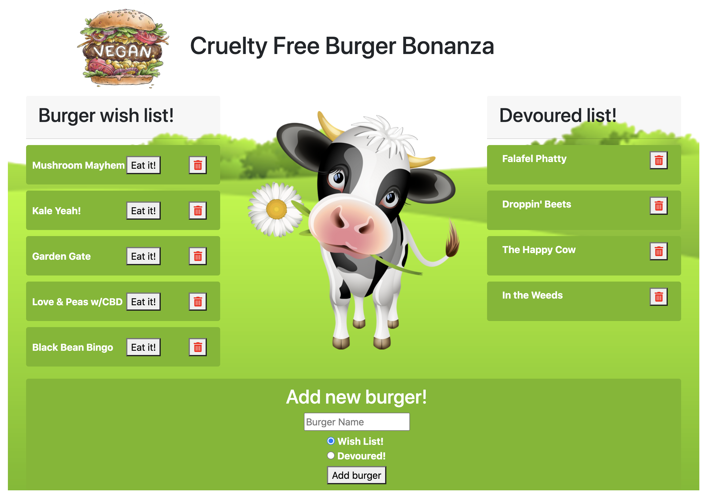

# Plant Based Burger Bonanza

Plant Based Burger Bonanza is a fun way to log all those delicious veggie burgers you've had your eye on, or ones you've already devoured!

[You can view the deployed app here:](https://plant-based-burger-bonanza.herokuapp.com/ "View Plant Based Burger Bonanza App") https://plant-based-burger-bonanza.herokuapp.com/

## Table of Contents
- [Usage](#How-to-use)
- [Languages](#Languages-and-Lessons)
- [Contribute](#How-to-contribute)
- [Questions](#Developed-by)
- [Credits](#Acknowledgments-and-Credits)
- [License](#Licensed-under-MIT)

## How to use
The app is very easy to use. Start by creating a 'Wish List' of burgers you'd like to eat. With every burger you eat just click the 'Eat It' button to move them over to the 'Devoured Lis'.

## Languages and Lessons
The exercises in this project focussed on learning SQL/MySQL, Express, Heroku Deployment, and Handlebars. Organization of files and separation of concerns with the MVC paradigm was also a large part of the project. 

## How to contribute
If anyone would like to improve the app by contributing, they're welcome to submit a pull request on [GitHub](https://github.com/keiththarp/plant-based-burger-bonanza).

## Developed by
- [Keith Tharp](https://github.com/keiththarp)

Please reach out with questions at:
  - keithstharp@gmail.com

Find more of Keith Tharp's work at:
  - https://github.com/keiththarp

## Acknowledgments and Credits
Thank you to all my fellow students and study groups that helped and supported with this homework project!
Special thanks to [Bobby](https://github.com/rhoffman103) for the Cats App launch pad!

## Licensed under MIT
[Click here for more information on the MIT license.](https://choosealicense.com/licenses/mit/)
